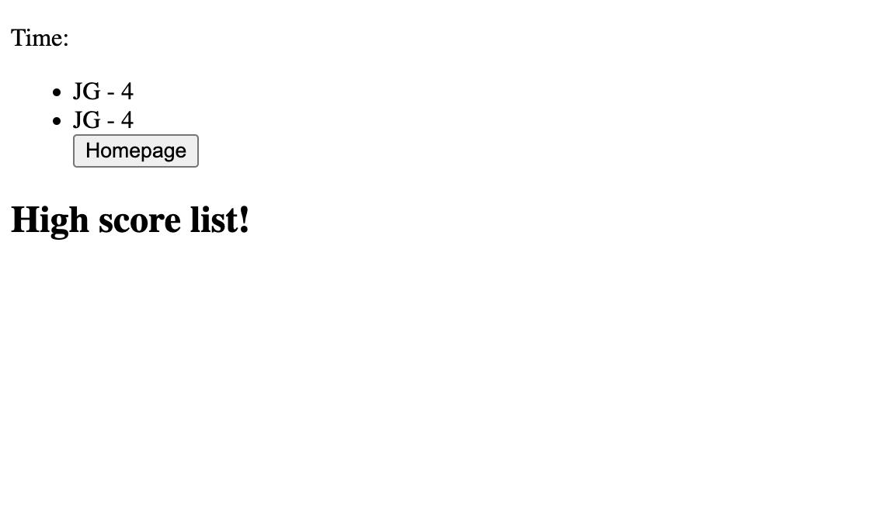
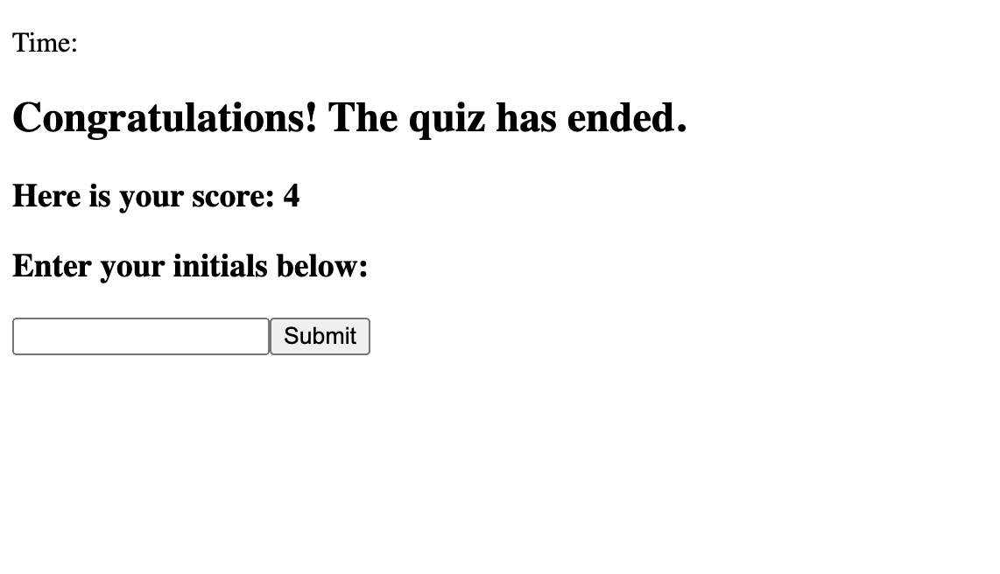
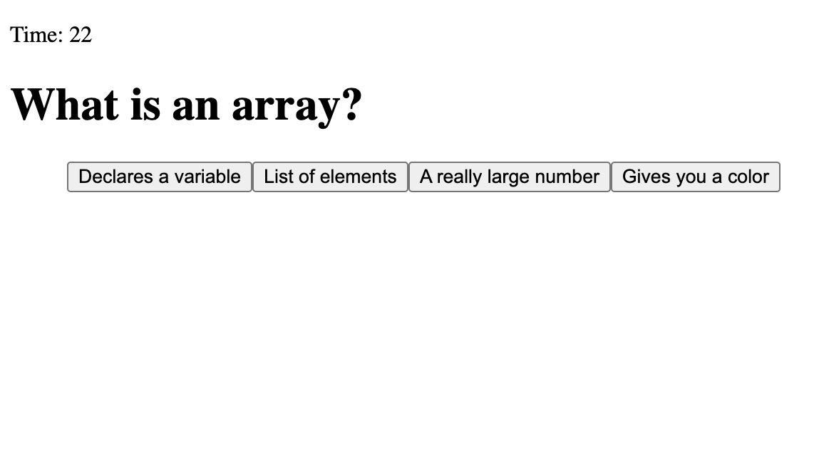
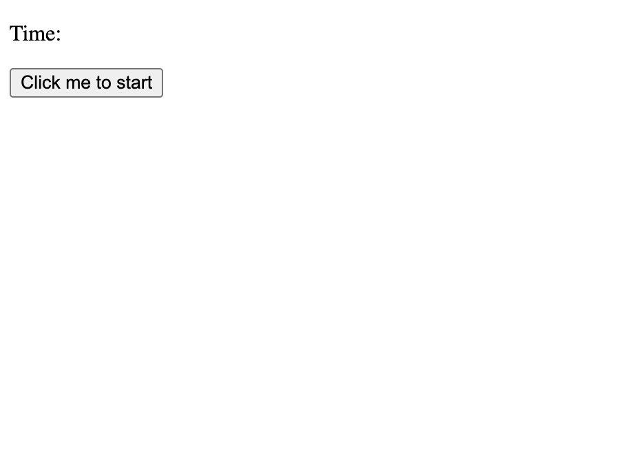

# Challenge04-Js
# <Your-Project-Title>

## Description


For challenge 04 our project was to create a quiz game that includes a timer, a questionnaire, display the players score, and display a high score list. As a full-stack developer, I will be asked to complete a coding assessment as part of the interview process.  A typical coding assessment includes both multiple-choice questions and interactive coding challenges. Creating this project will help prepare me by allowing me to implement the skills we've covered in this module thus far. My quiz game allows the user to interact by clicking on buttons to select the correct answer, displaying a high-score list, and by giving the user an option to play again. 


## Usage








    ```


